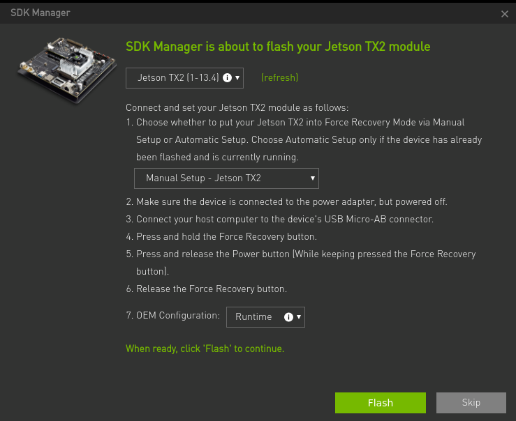
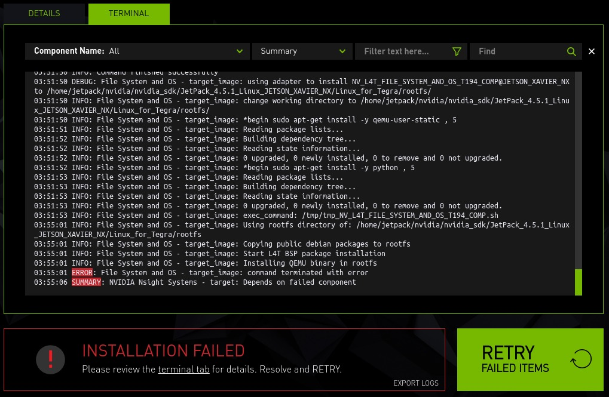

# systemrunner_docker

## Introduction

This is a Dockerfile to use TechnionAVFormula's proprietary Systemrunner code 

## Important Information

NVIDIA released official Docker image(<https://docs.nvidia.com/sdk-manager/docker-containers/index.html>).

## Requirements

* Docker
* Nvidia's container tool-kit [installation guide](https://docs.nvidia.com/datacenter/cloud-native/container-toolkit/install-guide.html)

## Preparation

### Download NVIDIA SDK Manager

Please download the package of NVIDIA SDK Manager from <https://developer.nvidia.com/nvidia-sdk-manager>.  
And, please put the package of NVIDIA SDK Manager in the same directory as the Dockerfile.  
This time, I used `sdkmanager_1.9.2-10899_amd64.deb`.

### Install Driveworks using the SDK Manager

The version currently used is `driveworks-2.2` Make sure the sdk is located at `/usr/local/driveworks-2.2`

### Install Systemrunner 

If you are a member of TechnionAVFormula (yes you!) download the respoistory using 

```
git clone https://gitlab.com/technionavformula/systemrunner.git --recurse-submodules
```
and place it in your docker user's home dir.

### Build Docker image
Put the sdkmanager deb in the same directory as the Dockerfile
Put the driveworks.pc in the same directory as the Dockerfile (should be in /usr/lib/pkgconfig/)

```
 docker build -t jetpack .
```

To build a Docker image with a specific SDK Manager version override the ``SDK_MANAGER_VERSION`` variable in the Docker command line

```
docker build --build-arg SDK_MANAGER_VERSION=1.9.2-10899 --build-arg GID=$(id -g) --build-arg UID=$(id -u) -t jetpack .
```

### Create Docker container

```
 ./launch_container.sh
```

## Launch NVIDIA SDK Manager

Please launch NVIDIA SDK Manager by the following command.

```
sdkmanager
```

Please refer to <https://docs.nvidia.com/sdk-manager/install-with-sdkm-jetson/index.html>.
And, I tested in the following setting.

* Manual Setup
* OEM Configuration: Runtime



## Notes

If you get errors like this, it means that QEMU is not installed in host/container



To configure QEMU, run below, either on host, or the running container.

```shell
./configure_qemu.sh
```
